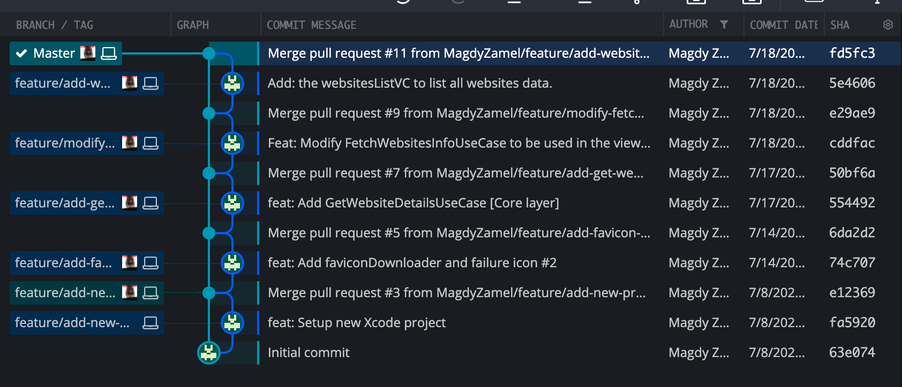

# Dapi Task

## Description

iOS Task that form dapi in the hiring process that  list  the websites URLs info from the datasource

## Run Requirements

- Mac with Apple silicon running macOS Big Sur 11 or later, or an Intel-based Mac running macOS Catalina 10.15.4 or later.
- Xcode 12.2.0 or later
- Swift 5
- iPhone with iOS 13.0 or later

## Package management systems Software

- Swift Package Manager (SPM).

## Services, Tools and technologies

- Networking → URL Session
- Threading → GCD, operations, and OperationQueue
- Favicon Icone Downloader →  [link](https://github.com/will-lumley/FaviconFinder)
- SwiftLint [optional] → [link](https://github.com/realm/SwiftLint)

## Notes :)

- I used GitHub project, issues and Merge requests
    - [https://github.com/MagdyZamel/DapiTask/projects/1](https://github.com/MagdyZamel/DapiTask/projects/1)
    - [https://github.com/MagdyZamel/DapiTask/issues?q=is%3Aissue+is%3Aclosed](https://github.com/MagdyZamel/DapiTask/issues?q=is%3Aissue+is%3Aclosed)
- I didn’t localized the content but i consider.
- i tried to mention the way that i deals with git so i used **GitFlow** as a git workflow.

- I didn’t fully focus on the UI, also please i pay attention that I am a Deuteranopia (red-green color blindness)

Thank you for reviewing my task
